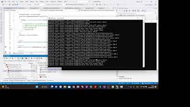

# About CoreWCF.Test

This repository contains unit tests to reproduce bugs in CoreWCF.

## The steps to reproduce the errors: 

- Build the solution in Visual Studio.
- Open Test Explorer.
- Run all the Tests in SolidCP.Server.Tests.
  The tests will open an instance of IISExpress running SolidCP.Server under .NET Framework 4.8 and an instance of Kestrel running SolidCP.Server under .NET 6.
- When prompted for the debugger to launch you choose the working visual studio instance in order to start debugging on CoreWCF & SolidCP.Server.

## Bugs:
The tests **AnonymousNet6** fail for NetHttp binding, and the **AuthenticatedNet6** that uses SoapHeaders implemented with a custom MessageInspector and UsernamePassword validation fails for all bindings.

### The stack trace for **AnonymousNet6** you get in Kestrel is this:

      Request starting HTTP/1.1 POST https://localhost:9007/net/Test application/soap+msbin1 161
      fail: Microsoft.AspNetCore.Server.Kestrel[13]
      Connection id "0HMPHB5RGV4OU", Request id "0HMPHB5RGV4OU:00000002": An unhandled exception was thrown by the application.
      System.NullReferenceException: Object reference not set to an instance of an object.
         at CoreWCF.Channels.RequestDelegateHandler.HandleRequest(HttpContext context) in C:\GitHub\CoreWCF.Tests\CoreWCF\src\CoreWCF.Http\src\CoreWCF\Channels\RequestDelegateHandler.cs:line 121
         at CoreWCF.Channels.ServiceModelHttpMiddleware.InvokeAsync(HttpContext context) in C:\GitHub\CoreWCF.Tests\CoreWCF\src\CoreWCF.Http\src\CoreWCF\Channels\ServiceModelHttpMiddleware.cs:line 49
         at CoreWCF.Channels.MetadataMiddleware.InvokeAsync(HttpContext context) in C:\GitHub\CoreWCF.Tests\CoreWCF\src\CoreWCF.Primitives\src\CoreWCF\Channels\MetadataMiddleware.cs:line 53
         at Microsoft.AspNetCore.Server.Kestrel.Core.Internal.Http.HttpProtocol.ProcessRequests[TContext](IHttpApplication`1 application)
      info: Microsoft.AspNetCore.Hosting.Diagnostics[2]
      Request finished HTTP/1.1 POST https://localhost:9007/net/Test application/soap+msbin1 161 - 500 0 - 1789.7733ms

### The stack trace you get for **AuthenticatedNet6** BasicHttpBinding is:

     Request starting HTTP/1.1 POST https://localhost:9007/basic/TestWithAuthentication text/xml;+charset=utf-8 1436
     info: Microsoft.AspNetCore.Server.Kestrel.Connections[34]
      Connection id "0HMPHB5RGV4P0", Request id "0HMPHB5RGV4P0:00000002": the application aborted the connection.
     fail: Microsoft.AspNetCore.Server.Kestrel[13]
      Connection id "0HMPHB5RGV4P0", Request id "0HMPHB5RGV4P0:00000002": An unhandled exception was thrown by the application.
      CoreWCF.Security.MessageSecurityException: Cannot find a token authenticator for the 'CoreWCF.IdentityModel.Tokens.UserNameSecurityToken' token type. Tokens of that type cannot be accepted according to current security settings.
         at CoreWCF.Security.ReceiveSecurityHeader.ReadTokenAsync(XmlReader reader, SecurityTokenResolver tokenResolver, IList`1 allowedTokenAuthenticators) in C:\GitHub\CoreWCF.Tests\CoreWCF\src\CoreWCF.Primitives\src\CoreWCF\Security\ReceiveSecurityHeader.cs:line 1631
         at CoreWCF.Security.ReceiveSecurityHeader.ReadTokenAsync(XmlDictionaryReader reader, Int32 position, Byte[] decryptedBuffer, SecurityToken encryptionToken, String idInEncryptedForm, TimeSpan timeout) in C:\GitHub\CoreWCF.Tests\CoreWCF\src\CoreWCF.Primitives\src\CoreWCF\Security\ReceiveSecurityHeader.cs:line 1494
         at CoreWCF.Security.ReceiveSecurityHeader.ExecuteReadingPassAsync(XmlDictionaryReader reader) in C:\GitHub\CoreWCF.Tests\CoreWCF\src\CoreWCF.Primitives\src\CoreWCF\Security\ReceiveSecurityHeader.cs:line 969
         at CoreWCF.Security.LaxModeSecurityHeaderElementInferenceEngine.ExecuteProcessingPassesAsync(ReceiveSecurityHeader securityHeader, XmlDictionaryReader reader) in C:\GitHub\CoreWCF.Tests\CoreWCF\src\CoreWCF.Primitives\src\CoreWCF\Security\LaxModeSecurityHeaderElementInferenceEngine.cs:line 19
         at CoreWCF.Security.ReceiveSecurityHeader.ProcessAsync(TimeSpan timeout, ChannelBinding channelBinding, ExtendedProtectionPolicy extendedProtectionPolicy) in C:\GitHub\CoreWCF.Tests\CoreWCF\src\CoreWCF.Primitives\src\CoreWCF\Security\ReceiveSecurityHeader.cs:line 746
         at CoreWCF.Security.TransportSecurityProtocol.VerifyIncomingMessageCoreAsync(Message message, TimeSpan timeout) in C:\GitHub\CoreWCF.Tests\CoreWCF\src\CoreWCF.Primitives\src\CoreWCF\Security\TransportSecurityProtocol.cs:line 157
         at CoreWCF.Security.TransportSecurityProtocol.VerifyIncomingMessageAsync(Message message, TimeSpan timeout) in C:\GitHub\CoreWCF.Tests\CoreWCF\src\CoreWCF.Primitives\src\CoreWCF\Security\TransportSecurityProtocol.cs:line 72
         at CoreWCF.Security.SecurityProtocol.VerifyIncomingMessageAsync(Message message, TimeSpan timeout, SecurityProtocolCorrelationState[] correlationStates) in C:\GitHub\CoreWCF.Tests\CoreWCF\src\CoreWCF.Primitives\src\CoreWCF\Security\SecurityProtocol.cs:line 596
         at CoreWCF.Dispatcher.ServerSecurityChannelDispatcher`1.VerifyIncomingMessageAsync(Message message, TimeSpan timeout, SecurityProtocolCorrelationState[] correlationState) in C:\GitHub\CoreWCF.Tests\CoreWCF\src\CoreWCF.Primitives\src\CoreWCF\Dispatcher\SecurityServiceDispatcher.cs:line 349
         at CoreWCF.Dispatcher.SecurityReplyChannelDispatcher.ProcessReceivedRequestAsync(RequestContext requestContext) in C:\GitHub\CoreWCF.Tests\CoreWCF\src\CoreWCF.Primitives\src\CoreWCF\Dispatcher\SecurityServiceDispatcher.cs:line 410
         at CoreWCF.Dispatcher.SecurityReplyChannelDispatcher.ProcessReceivedRequestAsync(RequestContext requestContext) in C:\GitHub\CoreWCF.Tests\CoreWCF\src\CoreWCF.Primitives\src\CoreWCF\Dispatcher\SecurityServiceDispatcher.cs:line 423
         at CoreWCF.Dispatcher.SecurityReplyChannelDispatcher.DispatchAsync(RequestContext context) in C:\GitHub\CoreWCF.Tests\CoreWCF\src\CoreWCF.Primitives\src\CoreWCF\Dispatcher\SecurityServiceDispatcher.cs:line 462
         at CoreWCF.Channels.AspNetCoreReplyChannel.HandleRequest(HttpContext context) in C:\GitHub\CoreWCF.Tests\CoreWCF\src\CoreWCF.Http\src\CoreWCF\Channels\AspNetCoreReplyChannel.cs:line 122
         at CoreWCF.Channels.RequestDelegateHandler.HandleRequest(HttpContext context) in C:\GitHub\CoreWCF.Tests\CoreWCF\src\CoreWCF.Http\src\CoreWCF\Channels\RequestDelegateHandler.cs:line 125
         at CoreWCF.Channels.ServiceModelHttpMiddleware.InvokeAsync(HttpContext context) in C:\GitHub\CoreWCF.Tests\CoreWCF\src\CoreWCF.Http\src\CoreWCF\Channels\ServiceModelHttpMiddleware.cs:line 49
         at CoreWCF.Channels.MetadataMiddleware.InvokeAsync(HttpContext context) in C:\GitHub\CoreWCF.Tests\CoreWCF\src\CoreWCF.Primitives\src\CoreWCF\Channels\MetadataMiddleware.cs:line 53
         at Microsoft.AspNetCore.Server.Kestrel.Core.Internal.Http.HttpProtocol.ProcessRequests[TContext](IHttpApplication`1 application)
      info: Microsoft.AspNetCore.Hosting.Diagnostics[2]
      Request finished HTTP/1.1 POST https://localhost:9007/basic/TestWithAuthentication text/xml;+charset=utf-8 1436 - 0 - - 1286.7635ms

### For **AuthenticatedNet6** with NetHttpBinding you get stack trace:

      Request starting HTTP/1.1 POST https://localhost:9007/net/TestWithAuthentication application/soap+msbin1 970
      fail: Microsoft.AspNetCore.Server.Kestrel[13]
      Connection id "0HMPHB5RGV4P2", Request id "0HMPHB5RGV4P2:00000002": An unhandled exception was thrown by the application.
      System.NullReferenceException: Object reference not set to an instance of an object.
         at CoreWCF.Channels.RequestDelegateHandler.HandleRequest(HttpContext context) in C:\GitHub\CoreWCF.Tests\CoreWCF\src\CoreWCF.Http\src\CoreWCF\Channels\RequestDelegateHandler.cs:line 121
         at CoreWCF.Channels.ServiceModelHttpMiddleware.InvokeAsync(HttpContext context) in C:\GitHub\CoreWCF.Tests\CoreWCF\src\CoreWCF.Http\src\CoreWCF\Channels\ServiceModelHttpMiddleware.cs:line 49
         at CoreWCF.Channels.MetadataMiddleware.InvokeAsync(HttpContext context) in C:\GitHub\CoreWCF.Tests\CoreWCF\src\CoreWCF.Primitives\src\CoreWCF\Channels\MetadataMiddleware.cs:line 53
         at Microsoft.AspNetCore.Server.Kestrel.Core.Internal.Http.HttpProtocol.ProcessRequests[TContext](IHttpApplication`1 application)
      info: Microsoft.AspNetCore.Hosting.Diagnostics[2]
      Request finished HTTP/1.1 POST https://localhost:9007/net/TestWithAuthentication application/soap+msbin1 970 - 500 0 - 2.5982ms

### For **AuthenticatedNet6** WSHttpBinding you get:

      Request starting HTTP/1.1 POST https://localhost:9007/ws/TestWithAuthentication application/soap+xml;+charset=utf-8 1633
      fail: Microsoft.AspNetCore.Server.Kestrel[13]
      Connection id "0HMPHB5RGV4P4", Request id "0HMPHB5RGV4P4:00000002": An unhandled exception was thrown by the application.
      CoreWCF.Security.MessageSecurityException: Cannot find a token authenticator for the 'CoreWCF.IdentityModel.Tokens.UserNameSecurityToken' token type. Tokens of that type cannot be accepted according to current security settings.
         at CoreWCF.Security.ReceiveSecurityHeader.ReadTokenAsync(XmlReader reader, SecurityTokenResolver tokenResolver, IList`1 allowedTokenAuthenticators) in C:\GitHub\CoreWCF.Tests\CoreWCF\src\CoreWCF.Primitives\src\CoreWCF\Security\ReceiveSecurityHeader.cs:line 1631
         at CoreWCF.Security.ReceiveSecurityHeader.ReadTokenAsync(XmlDictionaryReader reader, Int32 position, Byte[] decryptedBuffer, SecurityToken encryptionToken, String idInEncryptedForm, TimeSpan timeout) in C:\GitHub\CoreWCF.Tests\CoreWCF\src\CoreWCF.Primitives\src\CoreWCF\Security\ReceiveSecurityHeader.cs:line 1494
         at CoreWCF.Security.ReceiveSecurityHeader.ExecuteFullPassAsync(XmlDictionaryReader reader) in C:\GitHub\CoreWCF.Tests\CoreWCF\src\CoreWCF.Primitives\src\CoreWCF\Security\ReceiveSecurityHeader.cs:line 1027
         at CoreWCF.Security.ReceiveSecurityHeader.ProcessAsync(TimeSpan timeout, ChannelBinding channelBinding, ExtendedProtectionPolicy extendedProtectionPolicy) in C:\GitHub\CoreWCF.Tests\CoreWCF\src\CoreWCF.Primitives\src\CoreWCF\Security\ReceiveSecurityHeader.cs:line 746
         at CoreWCF.Security.TransportSecurityProtocol.VerifyIncomingMessageCoreAsync(Message message, TimeSpan timeout) in C:\GitHub\CoreWCF.Tests\CoreWCF\src\CoreWCF.Primitives\src\CoreWCF\Security\TransportSecurityProtocol.cs:line 157
         at CoreWCF.Security.TransportSecurityProtocol.VerifyIncomingMessageAsync(Message message, TimeSpan timeout) in C:\GitHub\CoreWCF.Tests\CoreWCF\src\CoreWCF.Primitives\src\CoreWCF\Security\TransportSecurityProtocol.cs:line 72
         at CoreWCF.Security.SecurityProtocol.VerifyIncomingMessageAsync(Message message, TimeSpan timeout, SecurityProtocolCorrelationState[] correlationStates) in C:\GitHub\CoreWCF.Tests\CoreWCF\src\CoreWCF.Primitives\src\CoreWCF\Security\SecurityProtocol.cs:line 596
         at CoreWCF.Dispatcher.ServerSecurityChannelDispatcher`1.VerifyIncomingMessageAsync(Message message, TimeSpan timeout, SecurityProtocolCorrelationState[] correlationState) in C:\GitHub\CoreWCF.Tests\CoreWCF\src\CoreWCF.Primitives\src\CoreWCF\Dispatcher\SecurityServiceDispatcher.cs:line 349
         at CoreWCF.Dispatcher.SecurityReplyChannelDispatcher.ProcessReceivedRequestAsync(RequestContext requestContext) in C:\GitHub\CoreWCF.Tests\CoreWCF\src\CoreWCF.Primitives\src\CoreWCF\Dispatcher\SecurityServiceDispatcher.cs:line 410
         at CoreWCF.Dispatcher.SecurityReplyChannelDispatcher.ProcessReceivedRequestAsync(RequestContext requestContext) in C:\GitHub\CoreWCF.Tests\CoreWCF\src\CoreWCF.Primitives\src\CoreWCF\Dispatcher\SecurityServiceDispatcher.cs:line 423
         at CoreWCF.Dispatcher.SecurityReplyChannelDispatcher.DispatchAsync(RequestContext context) in C:\GitHub\CoreWCF.Tests\CoreWCF\src\CoreWCF.Primitives\src\CoreWCF\Dispatcher\SecurityServiceDispatcher.cs:line 462
         at CoreWCF.Channels.ReplyChannelDemuxer.ReplyChannelDispatcher.DispatchAsync(RequestContext context) in C:\GitHub\CoreWCF.Tests\CoreWCF\src\CoreWCF.Primitives\src\CoreWCF\Channels\ChannelDemuxer.cs:line 575
         at CoreWCF.Channels.AspNetCoreReplyChannel.HandleRequest(HttpContext context) in C:\GitHub\CoreWCF.Tests\CoreWCF\src\CoreWCF.Http\src\CoreWCF\Channels\AspNetCoreReplyChannel.cs:line 122
         at CoreWCF.Channels.RequestDelegateHandler.HandleRequest(HttpContext context) in C:\GitHub\CoreWCF.Tests\CoreWCF\src\CoreWCF.Http\src\CoreWCF\Channels\RequestDelegateHandler.cs:line 125
         at CoreWCF.Channels.ServiceModelHttpMiddleware.InvokeAsync(HttpContext context) in C:\GitHub\CoreWCF.Tests\CoreWCF\src\CoreWCF.Http\src\CoreWCF\Channels\ServiceModelHttpMiddleware.cs:line 49
         at CoreWCF.Channels.MetadataMiddleware.InvokeAsync(HttpContext context) in C:\GitHub\CoreWCF.Tests\CoreWCF\src\CoreWCF.Primitives\src\CoreWCF\Channels\MetadataMiddleware.cs:line 53
         at Microsoft.AspNetCore.Server.Kestrel.Core.Internal.Http.HttpProtocol.ProcessRequests[TContext](IHttpApplication`1 application)
      info: Microsoft.AspNetCore.Hosting.Diagnostics[2]
      Request finished HTTP/1.1 POST https://localhost:9007/ws/TestWithAuthentication application/soap+xml;+charset=utf-8 1633 - 500 576 application/soap+xml;+charset=utf-8 217.8012ms

## Yet another bug

Another failure you get if you modify the appsettings.json in SolidCP.Server and add a listening url for net.tcp like this

      {
        "applicationUrls": "https://localhost:9007;net.tcp://localhost:9020",
        "ServerCertificate": {
          "StoreLocation": "LocalMachine",
          "StoreName": "My",
          "FindType": "FindBySubjectName",
          "Name":  "localhost"
        }
      }

instead of just

      {
        "applicationUrls": "https://localhost:9007"

If you also setup NetTcp endpoints, Kestrel gives an Exception before any incoming WCF request, with the following stack trace:

      Request starting HTTP/1.1 GET https://localhost:9007/ - -
      info: CoreWCF.Channels.MetadataMiddleware[0]
      Configuring metadata to /AutoDiscovery
      info: CoreWCF.Channels.MetadataMiddleware[0]
      Configuring metadata to /BlackBerry
      info: CoreWCF.Channels.MetadataMiddleware[0]
      Configuring metadata to /CRM
      info: CoreWCF.Channels.MetadataMiddleware[0]
      Configuring metadata to /DatabaseServer
      fail: Microsoft.AspNetCore.Server.Kestrel[13]
      Connection id "0HMPHBFGMT519", Request id "0HMPHBFGMT519:00000002": An unhandled exception was thrown by the application.
      CoreWCF.CommunicationObjectFaultedException: The communication object, CoreWCF.Configuration.ServiceBuilder, cannot be used for communication because it is in the Faulted state.
         at CoreWCF.Channels.CommunicationObject.ThrowIfDisposedOrNotOpen() in C:\GitHub\CoreWCF.Tests\CoreWCF\src\CoreWCF.Primitives\src\CoreWCF\Channels\CommunicationObject.cs:line 728
         at CoreWCF.ServiceHostObjectModel`1.WaitForServiceBuilderOpening(ServiceBuilder serviceBuilder) in C:\GitHub\CoreWCF.Tests\CoreWCF\src\CoreWCF.Primitives\src\CoreWCF\ServiceHostObjectModel.cs:line 299
         at CoreWCF.ServiceHostObjectModel`1..ctor(IServiceProvider serviceProvider, ServiceBuilder serviceBuilder, ILogger`1 logger) in C:\GitHub\CoreWCF.Tests\CoreWCF\src\CoreWCF.Primitives\src\CoreWCF\ServiceHostObjectModel.cs:line 36
         at System.RuntimeMethodHandle.InvokeMethod(Object target, Span`1& arguments, Signature sig, Boolean constructor, Boolean wrapExceptions)
         at System.Reflection.RuntimeConstructorInfo.Invoke(BindingFlags invokeAttr, Binder binder, Object[] parameters, CultureInfo culture)
         at Microsoft.Extensions.DependencyInjection.ServiceLookup.CallSiteRuntimeResolver.VisitConstructor(ConstructorCallSite constructorCallSite, RuntimeResolverContext context)
         at Microsoft.Extensions.DependencyInjection.ServiceLookup.CallSiteRuntimeResolver.VisitRootCache(ServiceCallSite callSite, RuntimeResolverContext context)
         at Microsoft.Extensions.DependencyInjection.ServiceLookup.CallSiteVisitor`2.VisitCallSite(ServiceCallSite callSite, TArgument argument)
         at Microsoft.Extensions.DependencyInjection.ServiceLookup.CallSiteRuntimeResolver.Resolve(ServiceCallSite callSite, ServiceProviderEngineScope scope)
         at Microsoft.Extensions.DependencyInjection.ServiceProvider.CreateServiceAccessor(Type serviceType)
         at System.Collections.Concurrent.ConcurrentDictionary`2.GetOrAdd(TKey key, Func`2 valueFactory)
         at Microsoft.Extensions.DependencyInjection.ServiceProvider.GetService(Type serviceType, ServiceProviderEngineScope serviceProviderEngineScope)
         at Microsoft.Extensions.DependencyInjection.ServiceProviderServiceExtensions.GetRequiredService(IServiceProvider provider, Type serviceType)
         at Microsoft.Extensions.DependencyInjection.ServiceProviderServiceExtensions.GetRequiredService[T](IServiceProvider provider)
         at CoreWCF.Description.DispatcherBuilder.BuildDispatcher[TService](ServiceConfiguration`1 serviceConfig, IServiceProvider services) in C:\GitHub\CoreWCF.Tests\CoreWCF\src\CoreWCF.Primitives\src\CoreWCF\Description\DispatcherBuilder.cs:line 718
         at CoreWCF.Configuration.ServiceConfiguration`1.GetDispatchers() in C:\GitHub\CoreWCF.Tests\CoreWCF\src\CoreWCF.Primitives\src\CoreWCF\Configuration\ServiceConfiguration.cs:line 41
         at CoreWCF.Configuration.DispatcherBuilderImpl.BuildDispatchers(Type serviceType) in C:\GitHub\CoreWCF.Tests\CoreWCF\src\CoreWCF.Primitives\src\CoreWCF\Configuration\DispatcherBuilderImpl.cs:line 23
         at CoreWCF.Channels.MetadataMiddleware.BuildBranch() in C:\GitHub\CoreWCF.Tests\CoreWCF\src\CoreWCF.Primitives\src\CoreWCF\Channels\MetadataMiddleware.cs:line 115
         at CoreWCF.Channels.MetadataMiddleware.EnsureBranchBuilt() in C:\GitHub\CoreWCF.Tests\CoreWCF\src\CoreWCF.Primitives\src\CoreWCF\Channels\MetadataMiddleware.cs:line 68
         at CoreWCF.Channels.MetadataMiddleware.BuildBranchAndInvoke(HttpContext request) in C:\GitHub\CoreWCF.Tests\CoreWCF\src\CoreWCF.Primitives\src\CoreWCF\Channels\MetadataMiddleware.cs:line 58
         at CoreWCF.Channels.MetadataMiddleware.InvokeAsync(HttpContext context) in C:\GitHub\CoreWCF.Tests\CoreWCF\src\CoreWCF.Primitives\src\CoreWCF\Channels\MetadataMiddleware.cs:line 53
         at Microsoft.AspNetCore.Server.Kestrel.Core.Internal.Http.HttpProtocol.ProcessRequests[TContext](IHttpApplication`1 application)
      info: Microsoft.AspNetCore.Hosting.Diagnostics[2]
      Request finished HTTP/1.1 GET https://localhost:9007/ - - - 500 0 - 1881.8673ms

# Additional Information

This repository contains unit tests from the SolidCP control panel that runs web services in the project SolidCP.Server.
The web services in SolidCP.Server are still in the WSE3 style with asmx files. From those services, WCF services and
client proxies are generated by a Roslyn SourceGenerator from SolidCP.Build. Those generated services and client
proxies are located in SolidCP.Server/WebServices. SolidCP.Server can be run under NET Framework 4.8 by running
the directory in IIS, and it can also run with NET 6 and Kestrel by running SolidCP.Server/bin/net.core/SolidCP.Server.exe.

SolidCP.Web.Services contains the basic creation of WCF Service endpoints for the generated services, for NET Framework
and NET Core. The project SolidCP.Web.Services is therefore compiled against NET Framework 4.8 and NET 6. When
running on NET Framework 4.8 it uses the classes from System.ServiceModel, when running on NET 6 it uses CoreWCF.

SolidCP.Web.Clients contains the base class for the generated web proxy classes in SolidCP.Server/WebServices in
ClientBase.cs. Every proxy has a Url property that must be set to the Url of the server, and a Protocol property that sets the
proxy url to the corresponding url. The proxy base class automatically chooses the right url for the protocol.

The project SolidCP.Server.Tests contains a few unit tests, that call the web services in SolidCP.Server. Those unit tests
cause the bug in CoreWCF, where there is a NullReferenceException in CoreWCF.Channels.RequestDelegateHandler.HandleRequest.
Another bug is caused, when the Server is configured to also support plain http and net.tcp endpoints. Then the creation of the service endpoints
fails.
